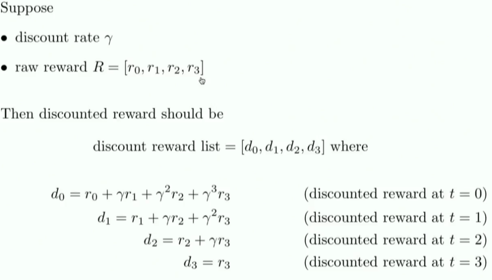
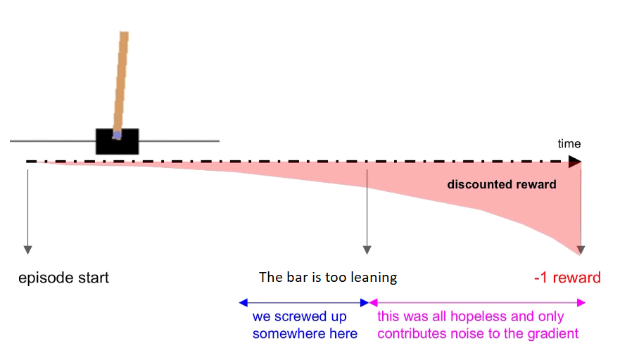

# Policy_gradients_CartPole
Policy Gradient Learning with CartPole-v0  

## Getting started
The challenge of the week was: <b>solving a simple game using policy gradients (other than pong).</b>
I've chosen CartPole v1.0 because that's a basic game and there is a ton of documentations/tutorials about that kind of game. 

### Goal 
CartPole-v0 defines "solving" as <b>getting average reward of 195.0 over 100 consecutive trials. </b>

### Dependencies
<ul>
  <li>numpy</li>
  <li>gym <a href="https://github.com/openai/gym"> https://github.com/openai/gym </a></li>
  <li> tensorflow </li>
</ul>

### Usage

 To be more readable and more easier to explain the code I use Jupyter Notebook  
 

 Run jupyter notebook in terminal and run all the cells 

## Walkthrough
### The CartPole

4 kinds of information given by the state:
<ul>
    <li>Position of the cart</li>
    <li> Velocity of the cart </li>
    <li> Position of the pole </li>
    <li> Velocity of the pole </li>
</ul>
 
An agent can push the cart:
<ul>
    <li> 0: left </li>
    <li> 1: right </ul>

### The NN

<i>Originally taken from, <a href="https://www.youtube.com/watch?v=pN7ETkOizGM">Siraj's Solving the basic game of Pong video </a> modified with my exceptional skills in paint </i>😂

### The advantage function

What we must understand here is that immediate rewards <b>are more important than delayed rewards.</b>

 That's why we use gamma as a discount factor 

Why ? Because <b>delayed rewards have less impact</b>: imagine you screw up at step 5 (the bar is too leaning) we don't care of rewards after that because you will lose that's why the reward is more and more discounted

<i>Originally taken from, <a href="https://www.youtube.com/watch?v=tqrcjHuNdmQ">DQN Bootcamp Lecture: Core Lecture 4b Pong from Pixels -- Andrej Karpathy </a>
  
  Remember that:
<ul>
    <li> A positive advantage --> make the action <b>more likely to happen in the future</b>, at that state </li>
    <li> A negative advantage --> make the action <b>less likely to happen in the future</b>, at that state</li>
</ul>

## Acknowledgments

This was made possible thanks these 2 fantastic resources:
<ul>
    <li> <a href="https://medium.com/@awjuliani/super-simple-reinforcement-learning-tutorial-part-2-ded33892c724">Simple Reinforcement Learning with Tensorflow: Part 2 - Policy-based Agents </a> : this article helps me to define a part of the architecture and helps me a lot for the training part.</li>
    
   
  <li> <a href="https://gist.github.com/shanest/535acf4c62ee2a71da498281c2dfc4f4" >Policy gradients for reinforcement learning in TensorFlow</a></li>
  </ul>

